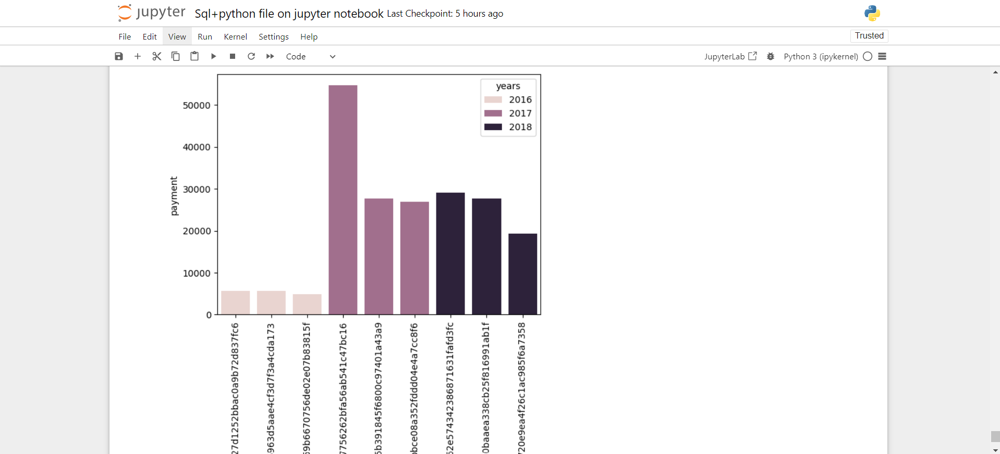

# E-commerce Data Analysis Project

## Overview

This project involves analyzing data from an e-commerce website using Python and SQL. The analysis is conducted by framing 15 key questions related to the data and answering them directly. The goal is to gain insights into various aspects of the e-commerce platform, such as customer behavior, product performance, and sales trends.

## Features

- **Question-Based Analysis**: The project is structured around 15 specific questions about the e-commerce data, each of which is answered with insights derived from the data.
- **SQL Queries**: Used to extract relevant information from the e-commerce database.
- **Data Interpretation**: Clear explanations provided for each question based on the query results.

## Technologies Used

- **Python**: For processing and scripting.
- **SQL**: For querying the database and retrieving data.
- **Pandas**: For data manipulation (if applicable).
- **Jupyter Notebook**: For documenting questions, queries, and answers.
- **MySQL**: For storing and querying the e-commerce data.

## Screenshots
Screenshot 1

Screenshot 2

Screenshot 3

## Installation

To run this project locally, you'll need to have Python installed along with the required libraries. You can install the dependencies using `pip`:

## Usage
1. Clone the repository:

2. Set up the SQL database and ensure the connection details are correct in the config.py file.

3. Run the Jupyter Notebook

4. Open the notebook files to review the questions and corresponding answers.

## Contributing
Feel free to submit issues or pull requests if you have any improvements or suggestions.

## License
This project is licensed under the MIT License - see the LICENSE file for details.
